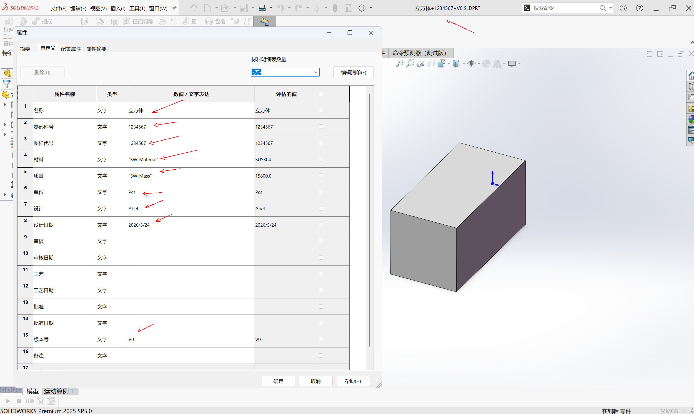

# SolidWorks 属性智能更新宏 (Property Updater Macro)

> 🏭 **SolidWorks 零件标准化工作流的一环**——通过宏自动化确保每一个 SW 文件都拥有一致、规范的自定义属性表，为后续 PDM、BOM 导出、工程图自动关联打下基础。



## 背景

在机械设计标准化流程中，自定义属性是数据链的关键环节。手工填写不仅费时，还容易遗漏或格式不一致。本宏将这一步骤自动化：

- **命名→属性**：通过规范的文件名（`名称+代号+版本`），一键拆解填充
- **16项标准属性**：覆盖设计、审核、工艺、批准全流程
- **日期自动管理**：保留原始设计日期，避免覆盖历史信息

## 功能特性

- **智能日期保留**：保留原有的"设计日期"，若不存在则自动填入当天日期
- **全量清理重建**：无论旧属性如何混乱，强制按 1-16 顺序重建标准属性表
- **文件名自动解析**：文件名格式为 `名称+代号+版本` 时自动拆分填充；格式不合规时弹出警告并留空关键项
- **零件/装配体自适应**：零件自动关联材料(`SW-Material`)和质量(`SW-Mass`)属性表达式，装配体则留空材料

## 属性表结构 (16项)

| 序号 | 属性名 | 填充方式 |
|------|--------|----------|
| 1 | 名称 | 文件名第1段 |
| 2 | 零部件号 | 文件名第2段 |
| 3 | 图样代号 | 文件名第2段 |
| 4 | 材料 | 零件: `SW-Material` / 装配体: 空 |
| 5 | 质量 | `SW-Mass` |
| 6 | 单位 | `Pcs` |
| 7 | 设计 | `Abel` |
| 8 | 设计日期 | 保留原值或当日 |
| 9 | 审核 | 空白（流程占位） |
| 10 | 审核日期 | 空白（流程占位） |
| 11 | 工艺 | 空白（流程占位） |
| 12 | 工艺日期 | 空白（流程占位） |
| 13 | 批准 | 空白（流程占位） |
| 14 | 批准日期 | 空白（流程占位） |
| 15 | 版本号 | 文件名第3段 |
| 16 | 备注 | 空白 |

## 文件命名规范

```
零件名称+图样代号+版本号.sldprt
```

示例：`底板+MDM-001+V1.0.sldprt`

- ✅ `底板+MDM-001+V1.0` → 自动拆分识别
- ⚠️ `底板` → 弹出警告，名称=底板，代号和版本留空

## 使用方法

1. 打开 SolidWorks 零件或装配体文件
2. `工具` → `宏` → `运行`，选择 `PropertyUpdater.swp`
3. 根据弹窗确认执行结果

> 💡 **建议**：将宏添加到 SolidWorks 自定义工具栏或绑定快捷键，实现一键标准化。

## 环境要求

- SolidWorks 2025（理论上兼容 2020+）
- 启用宏的 SolidWorks 环境

## 安装

1. 下载 `PropertyUpdater.bas`
2. 在 SolidWorks 中：`工具` → `宏` → `新建` → 粘贴代码 → 保存为 `.swp`
3. 可选：添加到 SolidWorks 自定义工具栏，绑定快捷键

## 许可

MIT License - 随意使用和修改。

## 作者

机械工程师，借助 AI 辅助开发。
